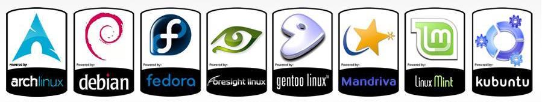
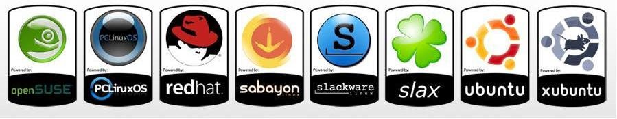
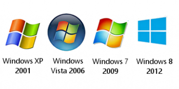

## Open Source Software Survival Essentials For Thriving, Foreseeably

## README Heading

- READ THIS ENTIRE DOC FIRST!!!

- [Author](https://github.com/jeremy-donson/): Jeremy Donson, NYC

- Date Created: Feb 5, 2018

- After reading this [FAQ](pages/faq.md), you are welcome to bring any and all questions [HERE](https://www.facebook.com/groups/BigDataProcessing)

- NOTES FOR THE NEOPHYTE:

1. Provided all precautions are taken as instructed,  
the likelihood of doing any damage to hardware or software from this recipe is nil.

2. Total costs of all tasks below = $0.

---

## Table of Contents

- [Systems Supported](#systems-supported)
- [Confronting & Resolving Fundamental User Concerns](#confronting-and-resolving-fundamental-user-concerns)
- [We Have Three Tasks To Consider-Plan-Execute](#we-have-three-tasks-to-consider-plan-execute)
- [Enhancements](#enhancements)
- [How To Contribute](#how-to-contribute)

---

## Systems Supported

- [Google Chromebooks](https://www.chromium.org/chromium-os)  
  
[Chromebook Support Info](pages/chromium-support.md)

- NOTE: The likelihood of doing any damage to hardware or software from this recipe is nil.  The costs are $0.

---

- [New & Legacy Systems Running Mac OSX](https://www.apple.com/macos/high-sierra/)  

</img>  

[Mac OSX Support Info](pages/osx-support.md)

- NOTE: The likelihood of doing any damage to hardware or software from this recipe is nil.  The costs are $0.

---

- All Flavors of [Linux](https://www.howtogeek.com/191207/10-of-the-most-popular-linux-distributions-compared/)  
</img>  

</img>  

[Linux Support Info](pages/linux-support.md)

- NOTE: The likelihood of doing any damage to hardware or software from this recipe is nil.  The costs are $0.

---

- And Even [Windows](https://en.wikipedia.org/wiki/List_of_Microsoft_Windows_versions)  

</img>  

[Windows Support Info](pages/win-support.md)

- NOTE: The likelihood of doing any damage to hardware or software from this recipe is nil.  The costs are $0.

---

## UNIVERSAL SYSTEM MANAGEMENT RULES OF SURVIVAL

- All computer users must know how to...

1. Securely backup and restore our personal account data.

2. Restore and update our computer operating system.

3. Install new applications and update them.

- Before launching into what tools like

* [bash](pages/bash-shell-basics.md)
* [git](pages/git-basics.md)
* [python3](pages/python3-basics.md)  

- can do for us, and how they work, we shall address our valid concerns **IN FULL**.

* WE WILL NOT speak to how to do anything wrong, often referred to giving us enough rope to hang ourselves.

* WE WILL speak to how to both correct and prevent such outcomes,  
starting with the most severe outcomes, and will work our way to increasingly less severe.

- FOR EMPHASIS:  The likelihood of this doing any damage to hardware or software is nil.  The costs are $0.

---

## Confronting and Resolving Fundamental User Concerns

### There Are Three Major Valid Concerns

1. We entered admin mode and damaged the chromebook operating system in some way.

2. We erased personal data that we need.

3. We opened up a terminal window and got stuck on the command-line.

---

- PROBLEM: We entered admin mode and damaged the chromebook operating system in some way.

- CORRECTION:  [Restore the operating system](https://support.google.com/chromebook/answer/1080595?hl=en&ref_topic=3418733).  

- PREVENTION:  Only use admin mode when necessary, and exit admin mode when no longer needed. 

- PREVENTION #2:  Keep your system plugged in to avoid annoying hassles during admin-access tasks.

- FOR EMPHASIS: All computer users must know how to...

1. Securely backup and restore our personal account data.

2. Restore and update our computer operating system.

3. Install new applications and update them.


---

- PROBLEM: We erased personal data that we need.

- CORRECTION: Backup ALL of our local personal account data prior to doing ANY admin-access tasks.

- PREVENTION: We ought to be [backing up our personal data to gdrive](https://www.laptopmag.com/articles/get-100gb-free-google-drive-space-chromebook).

---

PROBLEM: We opened a terminal and got stuck on the command-line, which is admittedly cryptic and unforgiving.

CORRECTION: 

CORRECTION #2: 

PREVENTION: 

---

## We Have Three Tasks To Consider-Plan-Execute

1. Install package manager "chromebrew" onto our system: https://github.com/skycocker/chromebrew

- NOTE: Mac OSX user would use Homebrew, The 'Missing Package Manager':  http://brew.sh

- NOTE: Windows users would use Scoop, The 'Missing Package Manager':  http://scoop.sh

2. Use chromebrew package manager to install tools which we can then execute from the command-line.

- This is no different from installing an app, except that these tools are all run from the command-line.

[Chromebooks Default Shell Is Named crosh](https://www.howtogeek.com/170648/10-commands-included-in-chrome-oss-hidden-crosh-shell/)

- The bash shell is the linux standard, so we would [prefer to run the bash shell instead of crosh](http://chromeos-cr48.blogspot.com/2010/12/make-ctrlaltt-go-straight-to-bash.html).

3. Using chromebrew, the 'Missing Package Manager' install git and python3 locally:
```
$ chromebrew install git python3
```

- The likelihood of this doing any damage to hardware or software is nil.  The costs are $0.

- Checking available local storage space both before and after installation is wise:
```
$ df -h
```

- Checking available memory is also wise:
```
$ free -m
```

* Since those are two read-only commands, they therefore pose no threat at all, ever.

* Only write commands pose ANY potential threats to our systems.

- REMINDER: All of this can be uninstalled should we wish to "back out".

---

## Enhancements
- [x]: Resize header images.
- [ ]: Have beginners across systems test-drive this README doc.
- [ ]: Spin off linked subdocs per operating system.
- [ ]: Provide scripts to automate these tasks.
- [ ]: Translate this doc into other languages.

---

## How To Contribute
- Join the support group listed below and assist with answering questions.

---

After reading this [FAQ](pages/faq.md), bring any questions [HERE](https://www.facebook.com/groups/BigDataProcessing)  
[Author](https://github.com/jeremy-donson/): Jeremy Donson, NYC