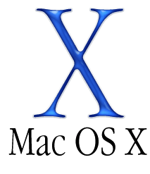

## Open Source Software Survival Essentials For Thriving, Foreseeably

## Table of Contents

- [Systems Supported](#systems-supported)
- [Confronting & Resolving Fundamental User Concerns](#confronting-and-resolving-fundamental-user-concerns)
- [We Have Three Tasks To Consider-Plan-Execute](#we-have-three-tasks-to-consider-plan-execute)
- [Enhancements](#enhancements)
- [How To Contribute](#how-to-contribute)

- Read entire doc first.
- After reading this [FAQ](pages/faq.md),  
bring any questions [HERE](https://www.facebook.com/groups/BigDataProcessing)  

---

## Systems Supported

- [Google Chromebooks](https://www.chromium.org/chromium-os)  
  
[Chromebook Support Info](pages/chromium-support.md)

- NOTE: The likelihood of doing any damage to hardware or software from this recipe is nil.  The costs are $0.

---

- [New & Legacy Systems Running Mac OSX](https://www.apple.com/macos/high-sierra/)  

</img>  

[Mac OSX Support Info](pages/osx-support.md)

- NOTE: The likelihood of doing any damage to hardware or software from this recipe is nil.  The costs are $0.

---

- All Flavors of [Linux](https://www.howtogeek.com/191207/10-of-the-most-popular-linux-distributions-compared/)  
</img>  

</img>  

[Linux Support Info](pages/linux-support.md)

- NOTE: The likelihood of doing any damage to hardware or software from this recipe is nil.  The costs are $0.

---

- And Even [Windows](https://en.wikipedia.org/wiki/List_of_Microsoft_Windows_versions)  

</img>  

[Windows Support Info](pages/win-support.md)

- NOTE: The likelihood of doing any damage to hardware or software from this recipe is nil.  The costs are $0.

---

## UNIVERSAL SYSTEM MANAGEMENT RULES OF SURVIVAL

- All computer users must know how to...

1. Securely backup and restore our personal account data.

2. Restore and update our computer operating system.

3. Install new applications and update them.

- Before launching into what tools like

* [bash](pages/bash-shell-basics.md)
* [git](pages/git-basics.md)
* [python3](pages/python3-basics.md)  

- can do for us, and how they work, we shall address our valid concerns **IN FULL**.

* WE WILL NOT speak to how to do anything wrong, often referred to giving us enough rope to hang ourselves.

* WE WILL speak to how to both correct and prevent such outcomes,  
starting with the most severe outcomes, and will work our way to increasingly less severe.

- FOR EMPHASIS:  The likelihood of this doing any damage to hardware or software is nil.  The costs are $0.

---

## Confronting and Resolving Fundamental User Concerns

1. [Running ChromeOS on a Chromebook]()

2. [Running OS X on a Mac]()

3. [Running Linux]()

4. [Running Windows]()

---

## Three Tasks To Consider-Plan-Execute

1. Install Missing Package Manager

2. Install Git Using Missing Package Manager

3. Install Python3 Using Missing Package Manager

---

## Enhancements
- [x]: Resize header images.
- [ ]: Spin off linked subdocs per operating system.
- [ ]: Have beginners across systems test-drive this README doc.
- [ ]: Provide scripts to automate these tasks.
- [ ]: Translate this doc into other languages.

---

## How To Contribute
- Join the [support group](https://www.facebook.com/groups/BigDataProcessing) listed below and assist with answering questions.

- Learn To Use:

1. Git to version our work.
2. Markdown to create, edit and format readme docs like this one.
- MathHeads: Note that markdown can support math symbols: A123 A123
3. Github.com to distribute and share our work.

---
After reading this [FAQ](pages/faq.md), bring any questions [HERE](https://www.facebook.com/groups/BigDataProcessing)  
[Author](https://github.com/jeremy-donson/): Jeremy Donson, NYC
- Date Created: Feb 5, 2018
